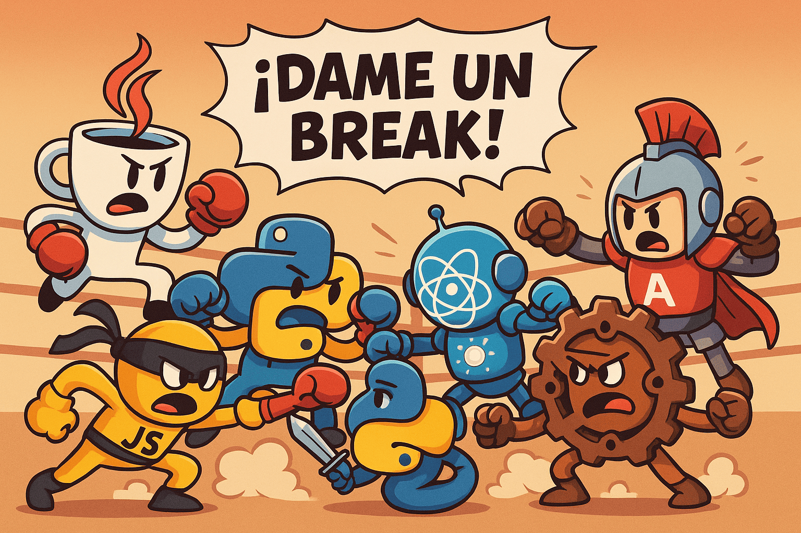

  

# Ingeniera de software / DameUnBreak()

Este repositorio tiene como propósito servir de espacio grupal para la clase de Ingeniería de Software. Aquí iremos subiendo y organizando las tareas, talleres, documentación y avances del proyecto principal, poniendo en práctica los conceptos y herramientas aprendidas durante el semestre.

## Estructura
- `Documentación/` información de proyecto (casos de uso, diagramas, scripts).
- `Asignaciones/` tareas y talleres.
- `Proyecto/` código del proyecto principal (estructura libre, buenas prácticas / arquitectura limpia).

## Convenciones de nombres
- Individual: `Tarea_##_<nickname>.pdf` (p. ej., `Tarea_01_jdoe.pdf`)
- Grupal: `Tarea_##.pdf`
- Talleres: `Taller_<tema>.pdf`
- Casos de uso: `CU_<nickname>_01.pdf`, `CU_<nickname>_02.pdf`, ...

## Flujo de trabajo Git
1. Crear rama por feature: `feature/<tema>`
2. Commit pequeño y descriptivo.
3. Pull Request a `main` (revisión de cambios).
4. Merge con squash o rebase (equipo decide).

## Requisitos / Cómo ejecutar (si aplica)
Instrucciones de instalación/uso para el proyecto.

